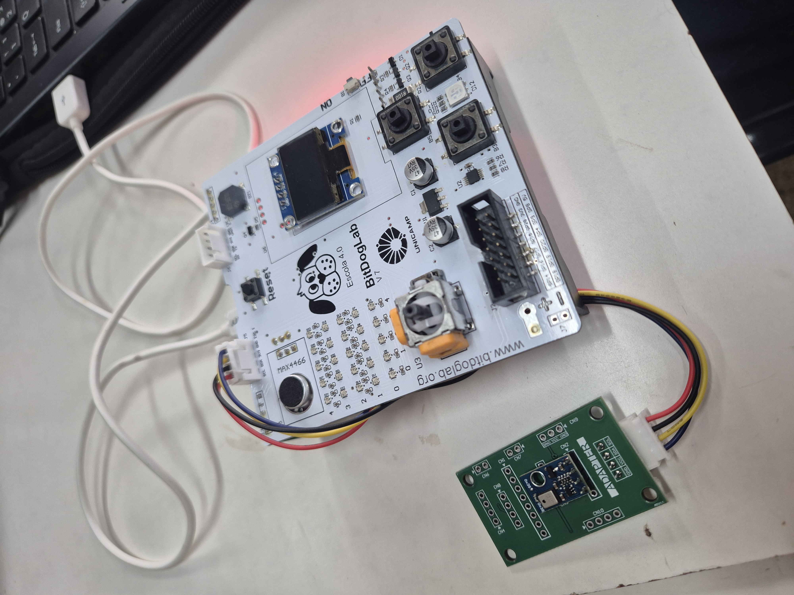

# <AHT10> — Sensores na BitDogLab

**Dupla:** João Senírio 245760/JoaoSenirio - Antônio Victor Morasi 167218/VictMorasi  
**Turma:** EA801 — 2025S2  
**Repositório:** https://github.com/JoaoSenirio/sensor_humidadeTemperatura_Costa_Morasi

## 1. Descrição do sensor
- Fabricante / modelo: Asair/AHT10
- Princípio de funcionamento: O elemento de umidade é um sensor capacitivo fabricado por tecnologia MEMS. A variação da umidade altera a constante dielétrica do material, o que muda a capacitância, que posteriormente é transformada em sinal elétrico a ser lida pelo chip ASIC dedicado. Quanto ao funcionamento do elemento de temperatura, o datasheet indicada apenas que é um sensor padrão de temperatura on-chip. 
- Tensão/consumo típicos: Tensão: 3.3V - Consumo típico em sleep 0.9 uW - Consumo típico em medição 0.07 mW.
- Faixa de medição / resolução: Faixa de medição humidade: 0 - 100 %RH e Resolução humidade: 0.024 %RH. Faixa de medição temperatura: -40 - 85 °C e Resolução temperatura: 0.01 °C.
- Datasheet (URL): https://server4.eca.ir/eshop/AHT10/Aosong_AHT10_en_draft_0c.pdf

## 2. Conexões de hardware
- Tabela indicando as conexões entre BitDogLab e sensor:
- Observações (resistores, alimentação externa, níveis lógicos):

**Tabela de conexões (imagem em `docs/`):**  


## 3. Dependências
- MicroPython/C versão:
- Bibliotecas utilizadas: SSD1306 e ahtx0
- Como instalar (passo a passo):
Para instalar as bibliotecas indicadas, basta executar o comando abaixo na raiz do repositório git local. Isso deve gerar as bibliotecas no caminho src/lib. Uma vez feito isso, é preciso realizar o upload dos arquivos ssd1306.py e ahtx0.py no RP2040.

```bash
git submodule update --init --recursive
```

## 4. Como executar
```bash
# MicroPython: Inicializar os códigos em src no vscode ou no thonny por meio dos botões RUN. Também pode-se renomear os arquivos para main.py e realizar o upload no RP2040.
```

## 5. Exemplos de uso
- `src/exemplo_basico.py` — leitura bruta  
- `src/exemplo_filtrado.py` — leitura com média móvel

## 6. Resultados e validação
Abaixo, encontra-se o resultado do código implementado para descobrir os endereços dos dispositivos conectados no barramento i2c. Vemos que tem um dispositivo no endereço 0x38, correspondendo exatamente ao sensor em uso AHT10.


Dados preliminares dos códigos exemplo_basico.py e exemplo_filtrado.py foram salvos em test/logs. A seguir encontra-se as tabelas com os dados gerados, e fica nítido que as leituras de temperatura e umidade previamente tratadas com filtro de média móvel ficam bem mais estáveis.

### Leituras simples de Temperatura e Umidade

| Temperatura (°C) | Umidade Relativa (%) |
|------------------|----------------------|
| 23,45 | 57,07 |
| 23,48 | 57,08 |
| 23,50 | 57,05 |
| 23,49 | 57,10 |
| 23,51 | 57,08 |
| 23,48 | 57,01 |
| 23,48 | 57,03 |
| 23,49 | 56,98 |
| 23,50 | 56,99 |
| 23,51 | 56,95 |
| 23,50 | 56,96 |
| 23,52 | 56,96 |
| 23,49 | 56,95 |
| 23,50 | 56,92 |
| 23,51 | 56,93 |
| 23,49 | 56,83 |
| 23,51 | 56,80 |
| 23,50 | 56,83 |
| 23,51 | 56,90 |

### Leituras com médida móvel de Temperatura e Umidade

| Temperatura (°C) | Umidade Relativa (%) |
|-------------------------------|----------------------------------|
| 23,63 | 57,51 |
| 23,64 | 57,53 |
| 23,64 | 57,53 |
| 23,64 | 57,53 |
| 23,64 | 57,53 |
| 23,64 | 57,53 |
| 23,64 | 57,52 |
| 23,64 | 57,52 |
| 23,64 | 57,51 |
| 23,64 | 57,50 |
| 23,65 | 57,50 |
| 23,64 | 57,50 |
| 23,63 | 57,49 |
| 23,64 | 57,49 |
| 23,64 | 57,50 |
| 23,64 | 57,50 |
| 23,65 | 57,51 |
| 23,65 | 57,50 |
| 23,64 | 57,49 |

## 7. Licença
- Ver arquivo `LICENSE`.

---

> **Checklist de entrega**
> - [ ] README preenchido  
> - [ ] Foto/diagrama em `docs/`  
> - [ ] Código comentado em `src/`  
> - [ ] Testes em `test/` com instruções  
> - [ ] `relatorio.md` com lições aprendidas

## 📁 7. Estrutura do Repositório

O projeto segue o padrão definido pela disciplina EA801 — Sistemas Embarcados, 
visando padronizar as entregas e facilitar o reuso dos códigos e documentação.

Todos os arquivos de código devem estar em src/.
Diagramas, fotos, gráficos e documentos vão em docs/.
Scripts ou logs de teste ficam em test/.
O relatório técnico (relatorio.md) documenta todo o processo de engenharia.

Mantenha os nomes dos arquivos em minúsculas, sem acentos ou espaços, usando _ ou -.

```text
template_sensor/
├── README.md          → Descrição completa do projeto (sensor, ligações, execução e checklist)
├── relatorio.md       → Relatório técnico da dupla (resultados, análise e conclusões)
├── LICENSE            → Licença MIT de uso e distribuição
├── .gitignore         → Regras para ignorar arquivos temporários e binários
│
├── docs/              → Documentação e mídias
│   ├── ligacao.jpg    → Diagrama ou foto da ligação na BitDogLab
│   ├── esquema.pdf    → Esquemático opcional
│   └── outros arquivos de apoio
│
├── src/               → Códigos-fonte principais
│   ├── main.py        → Código principal (MicroPython)
│   ├── main.c         → Versão alternativa (C / Pico SDK)
│   ├── exemplos/      → Códigos ilustrativos adicionais
│   └── bibliotecas/   → Drivers, módulos auxiliares
│
└── test/              → Testes e validações
    ├── test_basico.py → Teste de leitura e resposta do sensor
    ├── test_ruido.py  → Avaliação de ruído ou estabilidade
    └── logs/          → Registros experimentais, dados e gráficos

```