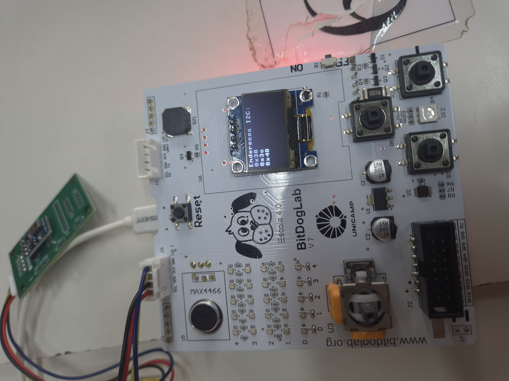

# Relatório Técnico da Dupla

## 1. Escopo e Objetivos
O objetivo do experimento era familiarizar-se com sensores digitais, buscando realizar a comunicação/leitura do sensor AHT10 via interface I2C, imprimindo, em tempo real, a temperatura e umidade. Ademais, também tinha-se a intenção de gerar a documentação no repositório de código (github) segundo o template fornecido, habituando-se aos modelos da disciplina EA801.

---

## 2. Metodologia e Implementação
Apresente os procedimentos adotados, incluindo a arquitetura do sistema, estratégias de programação, bibliotecas utilizadas e justificativas de projeto.  
Se aplicável, descreva o esquema de ligação elétrica, o protocolo de comunicação, as rotinas de aquisição e processamento de dados e o fluxo lógico do programa.  

**Sugestão de tópicos a abordar:**
- Diagrama de blocos e descrição funcional dos módulos;  
- Linguagem e ambiente de desenvolvimento utilizados;  
- Configurações específicas da BitDogLab e periféricos;  
- Estratégias de depuração e calibração.

---

## 3. Resultados e Análise
A varredura dos endereços I2C, por meio do código src/endereco_sensor.py, gerou dois endereços, sendo 0x38 o endereço do sensor AHT10, como ilustrado na figura abaixo.



Ademais, os dados de temperatura e umidade foram obtidos por meio dos códigos em src/exemplo_basico.py e src/exemplo_filtrado.py, estando expressos nas tabelas abaixo. Percebe-se nitidamente que os dados oriundos do filtro de média móvel são um tanto mais estáveis que aqueles que não sofreram nenhum tipo de tratamento. Contudo, o ônus de se ter uma leitura mais estável é o tempo que demora até esse nível de estabilidade ser alcançado, uma vez que é necessário preencher o vetor/lista, o qual é atualizado a cada nova medida, sendo computada a média dos valores das ultimas 5 leituras armazenadas.

### Leituras simples de Temperatura e Umidade

| Temperatura (°C) | Umidade Relativa (%) |
|------------------|----------------------|
| 23,45 | 57,07 |
| 23,48 | 57,08 |
| 23,50 | 57,05 |
| 23,49 | 57,10 |
| 23,51 | 57,08 |
| 23,48 | 57,01 |
| 23,48 | 57,03 |
| 23,49 | 56,98 |
| 23,50 | 56,99 |
| 23,51 | 56,95 |
| 23,50 | 56,96 |
| 23,52 | 56,96 |
| 23,49 | 56,95 |
| 23,50 | 56,92 |
| 23,51 | 56,93 |
| 23,49 | 56,83 |
| 23,51 | 56,80 |
| 23,50 | 56,83 |
| 23,51 | 56,90 |

### Leituras com médida móvel de Temperatura e Umidade

| Temperatura (°C) | Umidade Relativa (%) |
|-------------------------------|----------------------------------|
| 23,63 | 57,51 |
| 23,64 | 57,53 |
| 23,64 | 57,53 |
| 23,64 | 57,53 |
| 23,64 | 57,53 |
| 23,64 | 57,53 |
| 23,64 | 57,52 |
| 23,64 | 57,52 |
| 23,64 | 57,51 |
| 23,64 | 57,50 |
| 23,65 | 57,50 |
| 23,64 | 57,50 |
| 23,63 | 57,49 |
| 23,64 | 57,49 |
| 23,64 | 57,50 |
| 23,64 | 57,50 |
| 23,65 | 57,51 |
| 23,65 | 57,50 |
| 23,64 | 57,49 |

---

## 4. Dificuldades e Soluções
Não foram encontradas dificuldades associadas à montagem do hardware. As maiores dificuldades concentraram-se em encontrar uma biblioteca para o sensor AHT10 que fosse compatível com RP2040 (a qual já encontra-se relacionada nesse repositório), fazer o upload dela para o RP2040 para que os códigos seguintes pudessem fazer o import dela, bem como o desenvolvimento do código que implementa o filtro de média móvel.

```bash
# No VSCode teclar F1 para abrir a janela de comandos e digitar o comando abaixo
Micropico: Upload project to Pico
```

Para o código que implementa o filtro de média móvel, assumiu-se que, enquanto estiver preenchendo o vetor/lista, nenhuma informação referente à temperatura e umidade são impressas. Quando o vetor/lista estiver totalmente preenchida, é realizado o shift para a esquerda - descartando a leitura mais antiga -, insere-se a nova medida no final do vetor e computa-se a média.

---

## 5. Conclusões e Trabalhos Futuros
Resuma as conclusões técnicas alcançadas e a avaliação crítica dos resultados.  
Indique aprimoramentos possíveis e oportunidades de extensão do trabalho, incluindo aplicações derivadas ou integração com outros módulos.

**Exemplos:**
- Otimizar a estabilidade do sinal por meio de filtragem digital;  
- Adaptar o código para o ambiente C/C++ (Pico SDK);  
- Integrar múltiplos sensores e consolidar dados via comunicação serial.

---

## 6. Referências
Liste as fontes técnicas e documentações consultadas, como datasheets, manuais de aplicação, artigos ou links de bibliotecas utilizadas.  
O formato de citação é livre, desde que contenha autor, título e origem.

